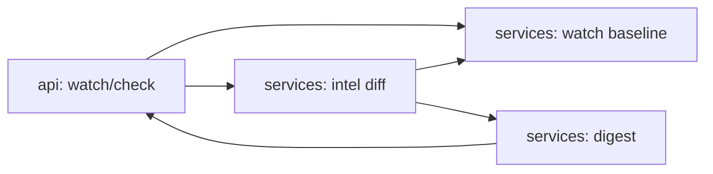

# agent-competitive-intel

[](https://github.com/Shamanchi/agent-competitive-intel/actions/workflows/ci.yml)
[](https://www.python.org/)
[](./Dockerfile)
[](./LICENSE)

> **English TL;DR:** FastAPI competitive-intelligence agent: watch competitors (price, features, news volume), diff new snapshots against the baseline, and build a markdown digest of moves. Fully offline with caller-provided signals; no tokens needed.

Агент конкурентной разведки: наблюдение за конкурентами (цена, фичи, новостной фон), сравнение новых снапшотов с базой и markdown-дайджест изменений. Сигналы передаёт вызывающая сторона, внешних ключей не нужно, работает офлайн.

Источник темы: `Hands-On-AI-Engineering / P-115 (competitive_intelligence_agent)` — идею и постановку взяли из каталога, код и тексты написаны с нуля.

## Какую задачу решает

Продуктовой команде нужно замечать ходы конкурентов: смену цен, новые фичи, всплески упоминаний. Агент хранит baseline по каждому конкуренту, сравнивает свежие сигналы и отдаёт список изменений + сводный дайджест.

## Архитектура



Слои: `api/` → `services/` → `core/`, настройки через `pydantic-settings`.

## Быстрый старт

```bash
cp .env.example .env
pip install -r requirements.txt
uvicorn app.main:app --reload
curl -X POST http://127.0.0.1:8000/api/v1/watch -H "Content-Type: application/json" -d "{\"competitor\": \"Acme\", \"price\": 99, \"features\": [\"sso\"], \"news_count\": 3}"
curl -X POST http://127.0.0.1:8000/api/v1/check -H "Content-Type: application/json" -d "{\"competitor\": \"Acme\", \"price\": 79, \"features\": [\"sso\", \"audit-log\"], \"news_count\": 9}"
```

Docker:

```bash
docker compose up --build
```

## API

- `GET /api/v1/health` — проверка сервиса.
- `POST /api/v1/watch` — зафиксировать baseline конкурента. Тело: `{"competitor": "Acme", "price": 99, "features": ["sso"], "news_count": 3}`.
- `POST /api/v1/check` — сравнить свежие сигналы с baseline, вернуть `changes`.
- `GET /api/v1/competitors` — список наблюдаемых конкурентов.
- `GET /api/v1/digest` — markdown-дайджест всех последних изменений.

Пример ответа `check` (сокращённо):

```json
{
  "competitor": "Acme",
  "changes": [
    {"kind": "price_drop", "detail": "99.0 -> 79.0 (-20.2%)"},
    {"kind": "feature_added", "detail": "audit-log"},
    {"kind": "news_spike", "detail": "3 -> 9 mentions"}
  ]
}
```

## Переменные окружения (.env)

| Переменная | Назначение | По умолчанию |
|---|---|---|
| `PRICE_ALERT_PCT` | Порог изменения цены в % для флага | `5.0` |
| `NEWS_SPIKE_MULT` | Во сколько раз должен вырасти фон для флага | `2.0` |
| `APP_HOST` / `APP_PORT` | Хост/порт API | `0.0.0.0` / `8000` |

Полный список — в [.env.example](./.env.example).

## Тесты

```bash
pip install -r requirements.txt
pytest -q
pytest -q -m integration
```

Unit-тесты без сети. Интеграционные (`-m integration`) — через TestClient, тоже без сети.

## Контакты

- Telegram: @PavelYrevichh
- Email: Lietman46@mail.ru
- GitHub: Shamanchi
- FL.ru: https://www.fl.ru/users/Shamanchi
